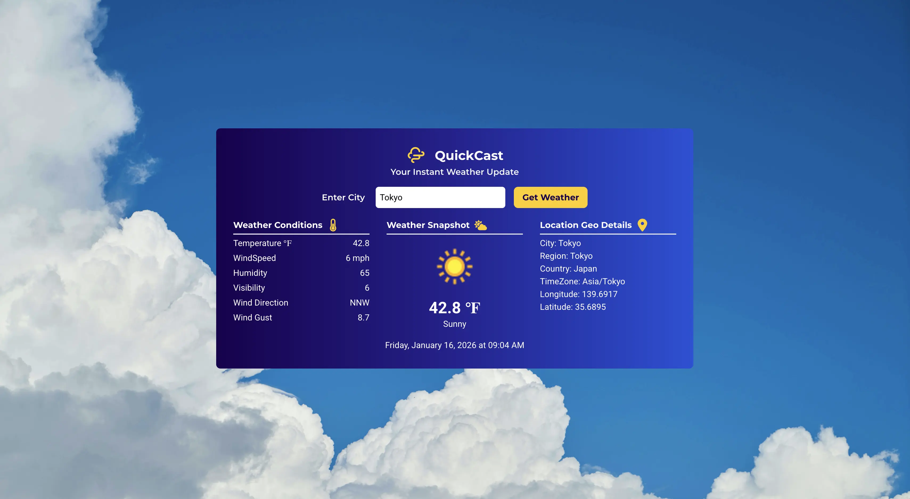

# 🌤️ QuickCast
### Your Instant Weather Update

QuickCast is a modern, responsive weather application that delivers real-time weather conditions for any city worldwide. With a clean interface, fast API responses, and detailed meteorological data, checking the weather has never been easier.

---

## 📸 Screenshot



---

🔗 **[Live Demo](https://meweatherapp.vercel.app/)**

---

## Overview

QuickCast provides instant access to comprehensive weather data with a focus on simplicity and speed. Built with modern web technologies, it combines real-time API integration with an intuitive user experience.

**Key Highlights:**
- Real-time weather data from trusted APIs
- Clean, minimalist design
- Fast search and response times
- Detailed location and weather metrics
- Fully responsive across all devices

---

## ✨ Features

### 🔍 **Global City Search**
- Search any city worldwide
- Instant results with autocomplete
- Support for international locations

### 🌡️ **Comprehensive Weather Data**
- **Temperature:** Real-time readings in °F
- **Conditions:** Clear weather descriptions (e.g., "Partly Cloudy", "Sunny")
- **Wind:** Speed, gusts, and direction
- **Humidity:** Current moisture levels
- **Visibility:** Distance in miles
- **Pressure:** Atmospheric readings

### 📍 **Detailed Geo-Location**
- City name
- Region/State
- Country
- Time zone
- Latitude & Longitude coordinates

### 🖼️ **Visual Weather Display**
- Dynamic weather condition icons
- Clean, readable layout
- Color-coded data presentation

### 📱 **Responsive Design**
- Mobile-first approach
- Works seamlessly on phones, tablets, and desktops
- Modern UI with smooth transitions

---

## 🖥️ Example Output

```
Temperature: 58.1 °F
Condition: Partly Cloudy
Wind Speed: 2.9 mph
Humidity: 50%
Visibility: 6 mi
Location: Mexico City, Mexico
Timezone: America/Mexico_City
Coordinates: 19.43°N, 99.13°W
```

---

## 🛠️ Tech Stack

**Frontend**
- Next.js (React Framework)
- JavaScript
- Modern CSS / Tailwind CSS
- Responsive Design

**API Integration**
- Weather API (real-time data)
- Location services
- Fast data fetching

**Deployment**
- Vercel (optimized hosting)
- Edge caching for speed
- Global CDN

---

## 🚀 Getting Started

### Prerequisites
- Node.js 18+
- Weather API key (sign up at weatherapi.com)

### Installation

1. **Clone the repository:**
   ```bash
   git clone https://github.com/your-username/quickcast.git
   cd quickcast
   ```

2. **Install dependencies:**
   ```bash
   npm install
   ```

3. **Set up environment variables:**
   
   Create `.env.local`:
   ```bash
   NEXT_PUBLIC_WEATHER_API_KEY=your_api_key_here
   ```

4. **Run development server:**
   ```bash
   npm run dev
   ```

5. **Open your browser:**
   ```
   http://localhost:3000
   ```

---

## 📦 Deployment

QuickCast is optimized for Vercel deployment:

1. Push your code to GitHub
2. Import project to Vercel
3. Add environment variables:
   - `NEXT_PUBLIC_WEATHER_API_KEY`
4. Deploy

Can also be deployed on any platform supporting Next.js (Netlify, Railway, etc.)

---

## 🧠 What I Focused On

**Clean UI/UX**
- Minimalist design that doesn't overwhelm
- Clear visual hierarchy
- Intuitive user flow

**Real-Time Data**
- Fast API calls with error handling
- Accurate, up-to-date weather information
- Responsive data updates

**Clear Data Presentation**
- Easy-to-read metrics
- Organized information layout
- Visual weather indicators

**Practical Design**
- Mobile-friendly interface
- Accessible for all users
- Performance-optimized

---

## 🌟 Key Features Breakdown

| Feature | Description |
|---------|-------------|
| 🔍 Search | Instant city lookup with global coverage |
| 🌡️ Temperature | Real-time readings in °F |
| 🌥️ Conditions | Current weather status with icons |
| 💨 Wind Data | Speed, gusts, and direction |
| 💧 Humidity | Moisture percentage |
| 👁️ Visibility | Distance in miles |
| 📍 Location | Complete geo-data with timezone |
| 📱 Responsive | Works on all screen sizes |

---

## 🎯 Future Enhancements

- [ ] 7-day weather forecast
- [ ] Hourly predictions
- [ ] Weather alerts and warnings
- [ ] Favorite cities list
- [ ] Temperature unit toggle (°F/°C)
- [ ] Weather maps integration
- [ ] Historical weather data

---

## 📄 License

MIT — Free to use and modify.

---

## 🤝 Contact

Built by [Your Name]

- Portfolio: [your-portfolio.com]
- GitHub: [@your-username]
- Email: your-email@example.com

**Thanks for checking out QuickCast! Stay weather-aware. 🌤️**
